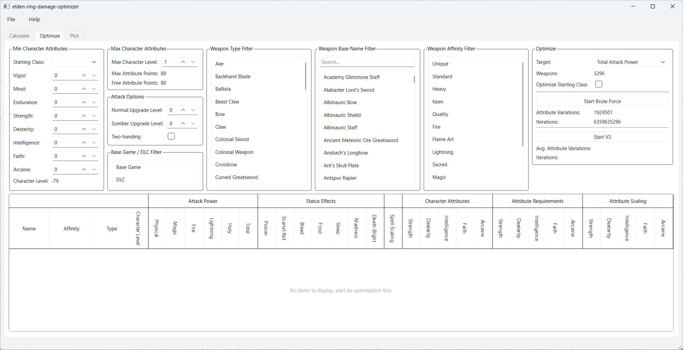
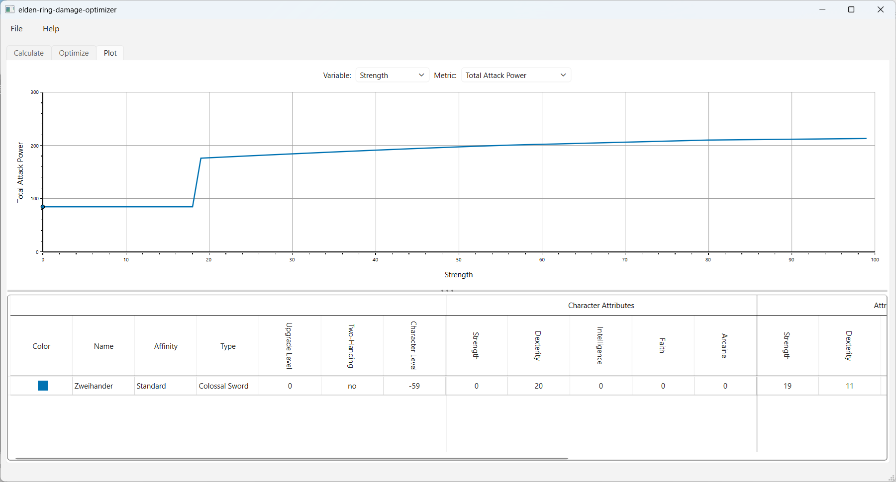

# elden-ring-damage-optimizer
A tool to calculate, optimize and plot Elden Ring attack rating. It finds the optimal way to allocate attribute points to maximize attack rating with any weapon.

## Downloading and Running
The latest release can be downloaded [here](https://github.com/hanslhansl/elden-ring-damage-optimizer/releases). Windows might flag the application *elden-ring-damage-optimizer.exe* as unrecognized and potentially dangerous. It isn't, of course, but there is no way to convince Windows/Microsoft of the contrary (other than paying for an official certificate). The pop-up can be skipped by pressing *More info* and *Run anyway*. Alternatively, the project can also be [built from source](#Building).

## Usage

### Calculate

This tab simply calculates the attack rating of all weapons.

The character attributes as well as other attack options (upgrade level, two-handing) can be adjusted in the upper half. The filters allow to filter the result for *weapon type*, *base name* etc.

The result is displayed in the lower half. The table can be sorted by clicking on the respective column header. Columns can be disabled/enabled by right-clicking the table header and choosing from the context menu. Right-clicking the table content opens a context menu with several helpful options.

### Optimize

This tab finds the optimal character attribute distribution for given constraints.

The constraints (i.e. minimum character attributes, maximum character level, attack options) can be adjusted in the upper half. Again, there are also filters to filter the result.

The optimization is controlled in the top right section:
- The stat to optimize for is chosen with the *Target* dropdown.
- The *Brute Force* algorithm is pretty simple: It tries every attribute variation (satisfying the provided constraints) with every weapon (according to the filter options) and displays the best result.
- The *V2* algorithm takes only the scaling attributes of each weapon into account. This reduces the number of attribute variations and therefor computing time by orders of magnitude.
- The *Attribute Variations* fields show how many attack ratings per weapon the algorithm has to calculate.
- The *Iterations* fields are a good indicator for how computationally expensive the optimization will be. It displays the total number of attack ratings the algorithm has to calculate.

Note: For *Brute Force* a *Max Character Level* of $168$ and all *Min Character Attributes* equal to $0$ results in $59.896.875$ attribute variations and $192.628.350.000$ iterations (the highest possible). For *V2* the same setup results in only ~$354.168$ attribute variations and $1.139.007.301$ iterations.

The result is displayed in a table in the lower half. It is functionally identical to the *Calculate* result table.

### Plot

This tab plots calculated stats (e.g. total attack power) against input stats (e.g. strength level).

The input variable and output metric can be chosen at the very top.

The plot below will display all datasets as colored lines with the chosen variable on the x-axis and the chosen metric on the y-axis. The *origin value* of each dataset is indicated with a point in the plot.

The table at the bottom (similar to the *Calculate* and *Optimize* tables) displays the datasets. One dataset consists of a weapon and attack options as mentioned above.

Datasets can be added with a special pop-up dialog (by right-clicking the table and choosing *Add New Dataset*) or from the *Calculate* and *Optimize* tabs by right-clicking the respective row(s) and choosing *Add ... to Plot*.

Existing Datasets can be edited and removed by right-clicking them.

### Updating the Weapon Data
The apllication ships with the necessary [weapon data](xml_data). If, however, it becomes outdated (e.g. because of an Elden Ring update) or to use old/modded game data it is possible to regenerate it. For this, additional third-party applications are necessary:
- [WitchyBND](https://github.com/ividyon/WitchyBND)
- a FromSoftware gamedata unpacker (e.g. [Nuxe](https://github.com/JKAnderson/Nuxe))

It is best to follow the instructions provided by *WitchyBND* and the gamedata unpacker but the general workflow will be like this:
1. Unpack the Elden Ring gamedata in the game directory using the gamedata unpacker.
2. Open *elden-ring-damage-optimizer.exe*, in the top left navigate to *File->Generate Weapon Data from Game Data*.
3. Navigate to and select the Elden Ring executable (*eldenring.exe*).
4. Next, navigate to and select the Witchy executable (*WitchyBND.exe*).
5. Finally, choose a directory to save the resulting weapon data to. The default directory is [xml_data](xml_data).
6. Afterwards, the generation process will begin. A bunch of text will be printed to the console window (which isn't relevant as long as everything works). The process is complete once "*successfully unpacked and converted uxm files to xml in ...*" is printed to the console.

The new weapon data can enabled via the *File* menu in the top left.

## Credits
The logic for calculating a weapon's attack rating as well as for extracting the weapon data from the game data was taken from [ThomasJClark/elden-ring-weapon-calculator](https://github.com/ThomasJClark/elden-ring-weapon-calculator). This project would not have been possible without that help. Thank You.

Many thanks to the developers of the dependencies listed below too.

## Building
The project requires c++26. It is built using [cmake](https://cmake.org/).

The dependencies are:
- [CPM.cmake](https://github.com/cpm-cmake/cpm.cmake) (package manager)
- [pugixml](https://github.com/zeux/pugixml)
- [Catch2](https://github.com/catchorg/Catch2) (if building tests)
- [Qt](https://www.qt.io/), licensed under LGPL

The cmake build script automatically downloads *CPM.cmake* which it then uses to download *pugixml* and *Catch2*.

*Qt* needs to be provided seperately. Binaries and source are available on the official website. The Python script [build_qt.py](build_qt.py) may be used to build *Qt* with all required submodules from source.

### Supported Compilers
The project is tested and built with [this](https://github.com/mstorsjo/llvm-mingw) LLVM 24 Mingw-w64 toolchain.
