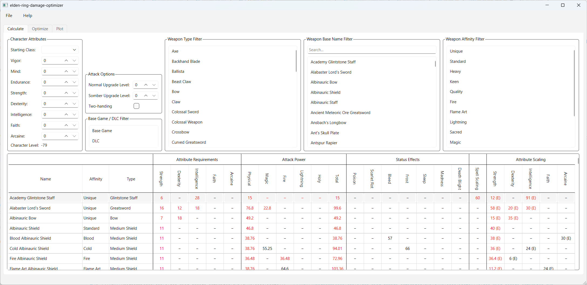

# elden-ring-damage-optimizer
A tool to calculate, optimize and plot Elden Ring attack rating. It finds the optimal way to allocate attribute points to maximize attack rating with any weapon.

## Downloading and Running
Download the latest release [here](https://github.com/hanslhansl/elden-ring-damage-optimizer/releases). After unzipping the directory run *elden-ring-damage-optimizer.exe*. Windows will tell you that this application is unrecognized and might put your PC at risk. It won't, of course, but unfortunatelly, there is nothing I can do about this pop-up. If you decide to trust me press *More info* and *Run anyway*. You can also [build](#Building) this project by yourself.

## Usage

### Calculate

### Optimize

### Plot

## notes on the optimization algorithm
The *brute force* algorithm is pretty simple: It tries every attribute variation (satisfying the provided minimum attributes and maximum character level) with every weapon (according to the weapon filter options) and returns the best result.

The *v2* algorithm takes only the scaling attributes of each weapon into account. This reduces the number of attribute variations and therefor computing time by orders of magnitude.

The *attribute variations* fields show how many attack ratings per weapon the algorithm has to calculate.

The *iterations* fields are a good indicator for how computationally expensive the optimization will be. It displays the total number of attack ratings the algorithm has to calculate

Note: For *brute force* a *max character level* of $168$ and all *min character attributes* equal to zero cause the highest possible attribute variations of $59.896.875$ and $192.628.350.000$ iterations. For *v2* the same setup results in only $~354.168$ attribute variations and $1.139.007.301$ iterations.

## updating the weapon data
The included [weapon data](xml_data) contains the necessary raw data. If, however, it becomes outdated (e.g. because of an Elden Ring update) or if you are playing on an old/modded version of the game you might want to generate your own regulation data file. To do this you'll need
- [WitchyBND](https://github.com/ividyon/WitchyBND)
- a FromSoftware gamedata unpacker (e.g. [Nuxe](https://github.com/JKAnderson/Nuxe))

It's best to follow the instructions provided by *WitchyBND* and your gamedata unpacker of choice but the general workflow will be like this:
1. Use the gamedata unpacker to unpack the Elden Ring game files into the game directory.
2. Open *erdo.exe*, in the top left navigate to *file->generate weapon data from game data*.
3. You will be prompted to select the Elden Ring executable (*eldenring.exe*).
4. Next, you will be prompted to select the Witchy executable (*WitchyBND.exe*).
5. Finally, you will be prompted to choose a directory to save the resulting weapon data to. You may choose [xml_data](xml_data).
6. Afterwards, the generation process will begin. A bunch of text will be printed to the console window (which isn't relevant as long as everything works). The process is complete once "*successfully unpacked and converted uxm files to xml in ...*" is printed to the console.

The new weapon data can used via the *file* menu in the top left.

## credits
The logic for calculating a weapon's attack rating as well as for extracting the weapon data from the game data was taken from [ThomasJClark/elden-ring-weapon-calculator](https://github.com/ThomasJClark/elden-ring-weapon-calculator). This project would not have been possible without that help. Thank You.

Thank you to the developers of the dependencies listed below too.
## building
The project requires c++26. It is built using [cmake](https://cmake.org/).

The dependencies are:
- [CPM.cmake](https://github.com/cpm-cmake/cpm.cmake) (package manager)
- [pugixml](https://github.com/zeux/pugixml)
- [Catch2](https://github.com/catchorg/Catch2) (if building tests)
- [Qt](https://www.qt.io/), licensed under LGPL

The cmake build script automatically downloads *CPM.cmake* which it then uses to download *pugixml* and *Catch2*.

*Qt* needs to be provided seperately. Binaries and source are available on the official website. You may use [build_qt.py](build_qt.py) to build *Qt* with all required submodules from source.

#### supported compilers
The project is tested and built with [this](https://github.com/mstorsjo/llvm-mingw) llvm 24 mingw-w64 toolchain.
