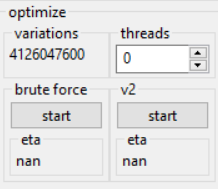

# elden-ring-damage-optimizer
A tool to find the optimal way to invest your levels into your attributes and maximize your attack rating with any weapon in Elden Ring.
## how it works
In short: You enter your character level and choose a weapon (or weapons) and the app calculates the highest possible attack rating and the stat distribution you need to achieve it. It saves you from wasting runes on useless attributes and the cumbersome trial-and-error process of finding the best stats in *Rennala's* respec screen.
#### loading the raw data
The raw weapon stats are saved in a regulation data file. To load the regulation data file choose *file->open reulation file* and load the *regulation_data.json* that comes with with this tool. Alternatively, you can also [generate your own](#updating-the-regulation-data).
#### setting the character stats

The *minimum stats* panel allows you to set the minimum stats you want your character to have. Your starting class (which you can set with the drop-down menu) will be the absolute baseline for this. If, let's say, you want your character to have 40 *vigor*, 25 *endurance* and 25 *faith* (to cast *Golden Vow*) you would enter those values in the corresponding fields and set the other 5 fields according to your starting class.

Enter your character's level into the *character level* widget. Simple. For a PVP build this will be 150. The widget *attribute points* denotes how many attribute points you have available to spread across the 8 attributes. A character at level 150 has 229 attribute points.

Note that the algorithm maximizes the attack rating by finding the best point distribution across *strength*, *dexterity*, *intelligence*, *faith* and *arcaine*. As *vigor*, *mind* and *endurance* don't affect the attack rating the result will have the same number of points across these 3 attributes as the minimum stats you provide here.

The *stat variations* field displays how many ways there are to spread the available attribute points across the 5 relevant attributes. This value depends on the character level and the minimum stats you provide. The higher this value, the more stat variations the algorithm has to check (per weapon) and the longer it will take (further explained under [the algorithm](#the-algorithm)). You can lower this number (and execution time) by being more specific with your minimum stats.
#### applying weapon filters

Usually you're not interested in the highest attack rating out of all weapons. Maybe you already know that you want a *Light Greatsword* build? Or maybe even more specific, a *Milady* build? Anyhow, these widgets allow you to run the optimization only on the weapons you are interested in. Selecting none of the options equals selecting all of them.

The *weapons* field displays the number of currently selected weapons. The more specific you are with your filters, the lower this number and the lower the algorithm's execution time.
#### miscellaneous

Choose the upgrade level to optimize for and whether you plan on two-handing your weapon.
#### choosing the optimization target

Choose what metric to optimize for. The most important metric is of course the total attack power rating. The second option allows you to optimize for a specific attack power type. This is especially useful if you are fighting a boss vulnerable to e.g. fire damage. If you want to maximize status effect build up you can choose the third option. The fourth option is useful for magic builds.
#### starting the optimization

The *variations* field is a good indicator for how computationally expensive the optimization will be as it displays the total number of attack ratings the algorithm has to calculate and then pick the single best one.

The *threads* widget allows you to choose how many threads you want to dedicate to  the algorithm. If you choose 0 it will autodetect the number of threads.

The *brute force* button starts the algorithm and *eta* will give an approximation for how long it will take (in seconds). This approximation should be taken with a grain of salt. The best way to find out is to just try it.

The *v2* algorithm isn't implemented as of yet.
#### the result

The result panel displays the result of the optimization. It also allows you to adjust the result if you aren't happy with it and immediatelly displays the updated attack rating.
## the algorithm
The brute force algorithm is pretty simple: It tries every stat distribution (satisfying the provided minimum stats and character level) with every weapon (according to the weapon filter options) and returns the highest result.

There are 3216 weapons in Elden Ring (counting every affinity as a unique weapon). That in itself wouldn't be a challenge for today's cpus. The algorithm's computing time is mainly driven by the number of different stat distributions. Depending on the minimum stats and character level provided by the user the number of stat distributions can be as high as 57.538.251 (at character level 174 and all minimum stats at 1). $57.538.251 * 3216 = 185.043.015.216$ total variations to iterate over. That's a lot. Even after all the tinkering I did my PC still takes ~10 minutes for this (unrealistic) worst case scenario (with 13 allocated threads).

The solution: Don't apply the brute force algorithm to all weapons at the same time. Use the weapon filters to limit the optimization to e.g. just one weapon type or maybe even to a single weapon. The further you are away from character level 174 (be it above or below) and all minimum stats at 1 the less time it will take too.

Actually, there is another solution: A smarter algorithm. I'm working on it.
## updating the regulation data
The included [regulation data file](new_regulation_data.json) contains all the necessary raw data. If, however, this file becomes outdated (e.g. because of an Elden Ring update) or if you are playing on an old version of the game you might want to generate your own regulation data file. To do this you'll need
- [UXM Selective Unpacker](https://github.com/Nordgaren/UXM-Selective-Unpack)
- [WitchyBND](https://github.com/ividyon/WitchyBND)

The first step is to use UXM to unpack the Elden Ring game files as explained on their Github page. AFAIK they are always unpacked directly into the game directory.

Next, open the *damage-optimizer.exe* and in the top left navigate to *file->generate regulation file->yes*. You will be prompted to choose the directory you previously unpacked the game files to (the game directory). Afterwards you will be prompted to choose the WitchyBND.exe file. Once that is done the generation process will begin. A bunch of text will be printed to the console window (which isn't relevant as long as everything works). The process is complete once *successfully generated regulation data file* is printed to the console.

The new *regulation_data.json* file will be created in same directory as the *damage-optimizer.exe* and can now be used via *file->open regulation file*.
## credits
The logic for calculating a weapon's attack rating as well as for creating the regulation data file was taken from [ThomasJClark/elden-ring-weapon-calculator](https://github.com/ThomasJClark/elden-ring-weapon-calculator). This project would not have been possible without that help. Thank You.

Thank you to the developers of the dependencies listed below too.
## buidling
The project requires C++23 because it uses some of the new std::ranges algorithms.

The dependencies are:
- [nlohmann/json](https://github.com/nlohmann/json)
- [bshoshany/thread-pool](https://github.com/bshoshany/thread-pool)
- [aantron/better-enums](https://github.com/aantron/better-enums)
- [zeux/pugixml](https://github.com/zeux/pugixml)
- [wxWidgets](https://github.com/wxWidgets/wxWidgets)

all of which are available on [vcpkg](https://vcpkg.io/).
#### supported compilers
The project is tested with msvc 19.40 and clang 18. Getting clang to run with vcpkg requires a bit of tinkering though.

The releases are built with clang because of the better code gen.
